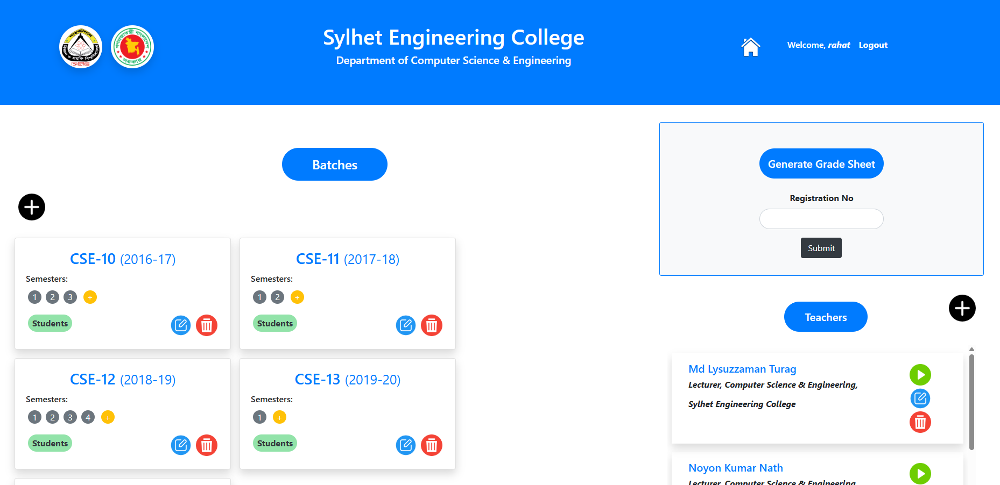
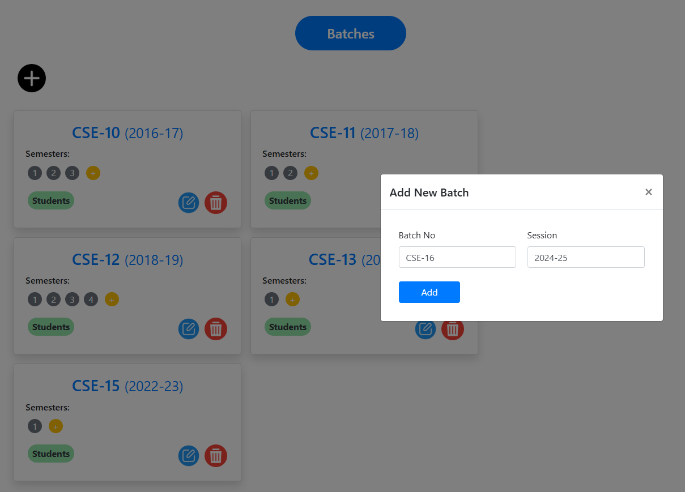

# UniMarx — University Result Management System

UniMarx is a lightweight result management system that streamlines academic record keeping for universities. It covers administrative setup, teacher-side assessment inputs, automatic calculations, and gradesheet generation.

  

## Key Features
- Admin can create, update, delete batches, semesters, courses, teachers, and students via the admin dashboard.
- Teachers get individual logins to manage only their assigned courses.
- Track continuous assessment per course: class attendance, term tests, assignments.
- Overall assessment is auto‑calculated from teacher inputs using predefined rules.
- Teachers can record final course results for each student.
- Admin can generate a gradesheet for any student.

## Roles & Workflow
- Admin: setup (batches/semesters/courses/users), oversight, gradesheet generation.
- Teacher: mark attendance, record assessments, confirm final results.
- System: auto‑compute overall assessment and provide tabulation/exports.

---

## Screenshots

  
Login page for both Admin and Teacher accounts.

  
Central hub for managing batches, semesters, courses, teachers, and students.

  
Admin form for creating a new batch and assigning basic metadata.

  
List and detail view of batches with quick actions.

  
Overview of courses with teacher assignments and actions.

  
Teacher interface to record class attendance for a course session.

  
Record term tests and assignment scores per student.

  
Auto‑calculated breakdown combining attendance, tests, and assignments.

  
Enter and confirm final course results for each student.

  
Aggregated view of students’ marks and grades for a course/semester.

  
Admin tool to select a student and generate their gradesheet.

  
Downloaded/printable PDF gradesheet for sharing and record‑keeping.

---

## Notes
- Designed to be simple to deploy and operate for departments and faculties.
- Extendable to custom grading policies or export formats as needed.

Feel free to open issues or suggestions to improve UniMarx.